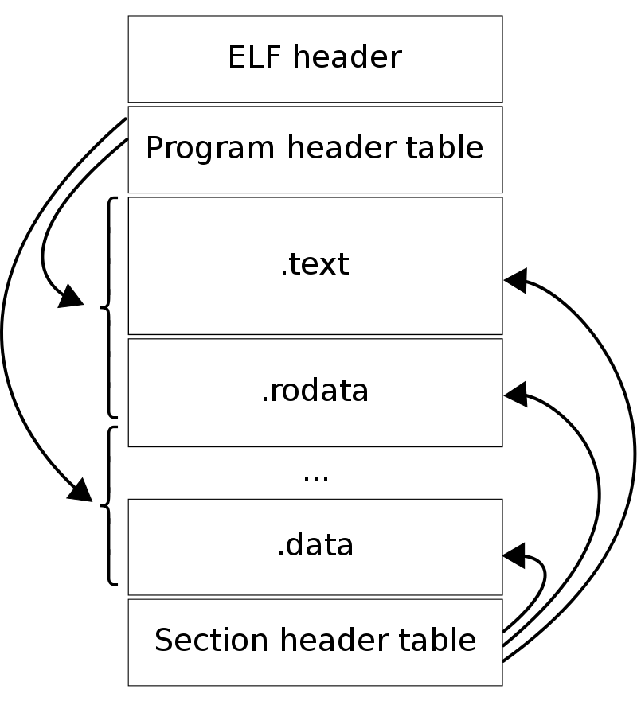

# RISC-V emulator

```markdown
学习中科院软件所PLCT Lab实验室的公开课: 手搓 RISC-V 高性能模拟器,参考文档: https://ksco.cc/rvemu/
```

## 补充知识

### Makefile相关

1. 编译选项
```markdown
编译器选项，用于控制编译器的行为和生成的代码的质量。
-O3：表示启用最高级别的优化。编译器将尝试执行更多的优化，以提高生成代码的性能。这可能会增加编译时间，但通常会产生更快的代码。
-Wall：启用所有警告。编译器将向您报告代码中的潜在问题，例如未使用的变量或不兼容的类型。
-Werror：将所有警告视为错误。如果编译器发出任何警告，则编译将失败，并显示相应的错误消息。
-Wimplicit-fallthrough：启用对C/C++ switch语句中隐式的case标签的警告。如果在switch语句中没有明确使用break关键字，编译器会发出警告，因为这可能会导致意外的行为。

这些选项通常用于开发人员希望生成高质量和可维护的代码。
```
2. 常用函数
```markdown
- `wildcard`
    在Makefile中，`wildcard`是一个函数，用于返回指定模式匹配的文件列表。语法如下：`wildcard pattern`,其中，`pattern`是要匹配的模式，可以包含通配符（如`*`和`?`）和目录分隔符（如`/`）。`wildcard`函数将返回与模式匹配的文件列表。在Makefile中，`wildcard`函数通常用于自动化编译源代码文件列表的过程。例如，可以使用`wildcard`函数将所有源文件的列表存储在一个变量中，然后使用这个变量来生成编译目标的依赖关系。
- `patsubst`
    在Makefile中，`patsubst`是一个函数，用于将一组字符串中的模式替换为另一个模式。语法如下：`patsubst pattern,replacement,string`,其中，`pattern`是要替换的模式，`replacement`是替换成的模式，`string`是包含要替换的字符串的列表。`patsubst`函数将返回一个新的字符串列表，其中包含所有输入字符串中所有匹配`pattern`模式的地方，都被替换为`replacement`模式。`patsubst`函数通常用于自动化生成Makefile规则中的目标和依赖项列表。
```

3. 常用自动变量
```markdown
使用自动化变量可以让Makefile更加灵活和可维护，因为它们可以自动适应规则的变化，而不需要手动修改命令行中的文件名。

- `$<`表示当前规则的第一个依赖项。
- `$@`表示当前规则的目标。
- `$^`表示当前规则的所有依赖项
- `$$`表示转义符号`$`
```

4. Makefile编译规则格式
```markdown
规则的语法如下：

targets: target-pattern: prereq-patterns...
        recipe

其中，`targets`是一个或多个目标文件，`target-pattern`是一个模式，用于指定目标文件名的格式。`prereq-patterns`是一个或多个依赖项模式，用于指定依赖项的格式。`recipe`是用于从依赖项构建目标文件的命令序列。

在以下例子`$(OBJS): obj/%.o: src/%.c $(HDRS)`

在这个例子中，该规则定义了一个模式规则，其中：

- `$(OBJS)`是一个或多个目标文件，它们的名称由模式`obj/%.o`指定。
- `obj/%.o`是目标文件名的模式，其中`%`表示匹配任意字符串。
- `src/%.c`是目标文件的依赖项模式，也是由`%`匹配任意字符串。
- `$(HDRS)`表示该规则的所有目标文件都依赖于`$(HDRS)`变量中定义的头文件。

因此，该规则指定了从每个`src/%.c`文件构建一个`obj/%.o`目标文件，其中的依赖关系由`$(HDRS)`变量定义。在构建目标文件时，Make将执行定义在规则下面的命令序列，用于编译源文件并生成目标文件。总之，这个规则的作用是将源文件编译成目标文件，并将目标文件放在`obj/`目录中。
```

5. 多进程编译
```markdown
"make -j" 是一个在Unix和类Unix系统中使用的命令行选项，用于指定在编译时使用的并行进程数量。 

"make" 是一个流行的构建工具，用于自动化构建程序。它使用 Makefile 文件来描述如何构建目标程序，包括源代码文件、依赖关系和构建规则等。使用 "-j" 选项可以同时运行多个编译任务，从而加快构建速度。

例如，如果有一个 Makefile 文件来编译一个程序，可以在命令行中使用 "make -j4" 命令来告诉 make 使用 4 个进程来编译程序，从而加快构建速度。这样做可以利用多核处理器的优势，提高编译效率。
```


### ELF文件相关
1. ELF文件格式


2. ELF文件program header里的虚拟地址和物理地址
```markdown
ELF 文件的 program header 包含了程序运行时需要的信息，其中包括了程序在内存中的布局信息。每个 program header 表示程序的一个段（segment），其中包含了一定范围内的内存映像。

在 program header 中，每个段都包含了以下信息：

- 虚拟地址（Virtual Address）：程序在内存中的虚拟地址，也就是程序在内存中的逻辑地址。当程序被加载到内存中时，系统会将这个段的内容复制到虚拟地址所指定的内存位置。
- 物理地址（Physical Address）：程序在内存中的物理地址，也就是程序在内存中的实际地址。物理地址只在操作系统内核中使用，用于管理内存，程序代码是不直接使用物理地址的。

虚拟地址和物理地址的作用如下：

- 虚拟地址是程序在内存中的逻辑地址，程序代码和数据都是以虚拟地址的形式存储和访问的，而不需要考虑物理地址的具体位置。这使得程序在不同的计算机上运行时能够保持相同的逻辑地址，从而提高了程序的可移植性。
- 物理地址是程序在内存中的实际地址，由操作系统内核管理和分配，程序代码是不直接使用物理地址的。物理地址的作用是在操作系统内核中管理内存，包括内存的分配、映射和保护等操作。

需要注意的是,操作系统在程序加载到内存时，可能会将程序的代码和数据映射到不同的物理地址上。这是因为操作系统需要保证程序在内存中的安全性和稳定性，有时需要将程序的代码和数据隔离开来，以防止恶意程序修改代码段中的指令，或者数据段中的数据。由于程序加载时的物理地址会受到操作系统的影响，因此 program header 中的物理地址并不总是与程序在内存中实际的物理地址一致。在程序运行时，操作系统内核需要根据 program header 中的信息将程序的不同段映射到正确的内存地址上。虽然映射地址可能与 program header 中的物理地址不同，但 program header 中的物理地址仍然是操作系统内核管理程序内存布局的重要参考。

另外需要说明的是，操作系统在程序加载时通常会根据程序的需要动态地分配和映射内存空间，因此程序在内存中的布局可能会随着时间的推移而发生变化。这就需要操作系统内核不断地更新 program header 中的信息，以保证程序在内存中的正确运行。

```
### C语言编程方面
1. fprintf格式化字符串

```markdown
#define fatalf(fmt, ...) (fprintf(stderr, "fatal: %s:%d" fmt "\n", __FILE__, __LINE__, __VA_ARGS__), exit(1))

C语言的语法支持使用空格分开格式化字符串。在C语言中，格式化字符串是由一个字符串常量和一系列格式化参数组成的。格式化参数的数量和类型与字符串中包含的格式说明符的数量和类型相匹配。

在格式化字符串中使用空格进行分隔是合法的，并且不会影响程序的编译和执行。编译器会将空格视为普通的字符，并将它们与其他字符一起组成格式化字符串。在运行时，函数将解析格式化字符串并将其与提供的参数进行匹配，以生成最终的输出。

因此，可以使用空格分开格式化字符串来提高代码的可读性和可维护性，这是C语言的语法所支持的。
```

2. C语言常用的预定义宏
```markdown
C语言中有许多预定义的宏，其中一些是常用的。下面列出了一些常用的预定义宏：

1. `__FILE__`：当前源文件的文件名。
2. `__LINE__`：当前代码行号。
3. `__DATE__`：当前源文件的编译日期。
4. `__TIME__`：当前源文件的编译时间。
5. `__STDC__`：如果编译器遵循 ANSI C 标准，则该宏的值为 1。
6. `__cplusplus`：如果编译器是 C++，则该宏的值为非零。
7. `NULL`：表示空指针的宏。
8. `EOF`：表示输入流结束的宏。
9. `CHAR_BIT`：表示 `char` 类型所占用的字节数。
10. `INT_MAX` 和 `INT_MIN`：表示 `int` 类型的最大值和最小值。
11. `FLT_MAX` 和 `FLT_MIN`：表示 `float` 类型的最大值和最小值。
12. `DBL_MAX` 和 `DBL_MIN`：表示 `double` 类型的最大值和最小值。

这些预定义宏可用于在程序中输出调试信息、定义常量等。使用它们可以使代码更加清晰易懂，并提高代码的可读性和可维护性。

需要注意的是，不同的编译器可能会定义不同的预定义宏，而且它们的值也可能会有所不同。因此，在使用预定义宏时，应该查看编译器的文档，以了解它们的确切含义和值。
```

3. `strerror(error)`的使用

```markdown

`strerror(errno)` 是一个C语言中的函数调用，用于将错误码 `errno` 转换为对应的错误信息字符串。

在C语言中，当系统调用或库函数发生错误时，它们通常会将错误码存储在全局变量 `errno` 中。程序员可以使用 `errno` 来判断函数是否执行成功，并根据需要采取相应的处理措施。但是，错误码本身并不容易理解，因此需要将其转换为人类可读的错误信息。

`strerror(errno)` 函数所需的头文件是 `<string.h>`，同时也需要包含 `<errno.h>` 头文件，以便使用全局变量 `errno`。其中，`<errno.h>` 头文件定义了错误码常量以及全局变量 `errno`，而 `<string.h>` 头文件则定义了 `strerror()` 函数。

需要注意的是，`strerror()` 函数在不同的操作系统和编译器中的行为可能会有所不同。在一些平台上，它可能会返回指针类型的字符串，而在另一些平台上，它可能会返回 `char*` 类型的字符串常量。因此，在实际使用中，需要查看操作系统和编译器的文档，以了解其确切的行为和用法。
```


4. C语言define的常量
```markdown
#define ELFMAG "\177ELF"
该字符串常量的值为 "\177ELF"，其中 "\177" 表示八进制数值 177，转义字符 "\177" 的 ASCII 码对应的是一个不可见的字符
#define GUEST_MEMORY_OFFSET 0x088800000000ULL
指定GUEST_MEMORY_OFFSET为unsigned long long类型
```

5. C语言中的fseek

```markdown
在 C 语言中，fseek 函数用于将文件内部的读写位置设置到指定位置，以便读写文件的指定部分。该函数的声明如下：
    int fseek(FILE *stream, long int offset, int whence);
其中，stream 是指向 FILE 类型结构的指针，表示要设置读写位置的文件；offset 是 long int 类型的值，表示相对于 whence 参数指定的位置的偏移量；whence 是整数类型的值，表示偏移量相对于哪个位置计算，可能的值为：
    - SEEK_SET：偏移量相对于文件开头计算。
    - SEEK_CUR：偏移量相对于当前的读写位置计算。
    - SEEK_END：偏移量相对于文件结尾计算。
函数返回值为 0 表示成功，非零值表示失败。
```

6. mmap
```markdown
mmap() 是一个系统调用，用于将一个文件或者其他对象映射到进程的虚拟地址空间中。mmap() 函数的原型如下：
    void *mmap(void *addr, size_t length, int prot, int flags, int fd, off_t offset);
    
参数说明：

- addr：指定映射的起始地址，通常设置为 NULL，表示让操作系统自动选择映射地址。
- length：指定映射区域的长度，单位是字节。
- prot：指定映射区域的访问权限。它可以是以下值中的一个或者多个：
  - PROT_READ：可读。
  - PROT_WRITE：可写。
  - PROT_EXEC：可执行。
  - PROT_NONE：不可访问。
- flags：指定映射的选项。它可以是以下值中的一个或者多个：
  - MAP_FIXED：强制使用指定起始地址。
  - MAP_PRIVATE：创建一个私有的映射，对映射区域的修改不会影响到原文件。
  - MAP_SHARED：创建一个共享的映射，对映射区域的修改会影响到原文件。
  - MAP_ANONYMOUS：映射一个匿名内存区域。
- fd：指定要映射的文件的文件描述符，如果映射的是匿名内存区域，则将它设置为 -1。
- offset：指定映射区域在文件中的偏移量，单位是字节。如果映射的是匿名内存区域，则将它设置为 0。

mmap() 函数成功时返回映射区域的起始地址，失败时返回 MAP_FAILED。调用 mmap() 函数后，可以通过访问映射区域的起始地址来访问文件或者匿名内存区域。
```

### JIT技术
```markdown
JIT（即时编译）技术是一种在程序运行时将源代码或中间代码转换为本地机器代码的技术。在 JIT 编译过程中，程序的代码被分解成更小的代码块，然后这些代码块被逐个编译并执行。JIT 技术的目的是通过在程序运行时动态生成本地机器代码来提高程序的性能。

JIT 技术通常用于解释执行的语言，例如 Java、JavaScript 和 Python 等。在这些语言中，源代码被解释器解释成中间代码，然后再由 JIT 编译器将中间代码转换为本地机器代码。这样做的好处是，JIT 编译器可以根据程序的运行情况，动态地优化代码，以提高程序的性能。

JIT 技术的优点包括：

1. 更快的程序执行速度，因为 JIT 编译器可以在程序运行时动态地生成本地机器代码。

2. 更好的内存管理，因为 JIT 编译器可以通过垃圾回收等技术来管理内存，减少内存泄漏和溢出等问题。

3. 更好的跨平台支持，因为 JIT 编译器可以根据不同的硬件和操作系统生成不同的本地机器代码，以保证程序在不同的平台上都能正常运行。

4. 更好的安全性，因为 JIT 编译器可以在编译过程中检查代码的安全性，以避免潜在的安全漏洞。

总之，JIT 技术可以显著提高程序的性能和可靠性，并且被广泛应用于各种编程语言和应用程序中。
```

